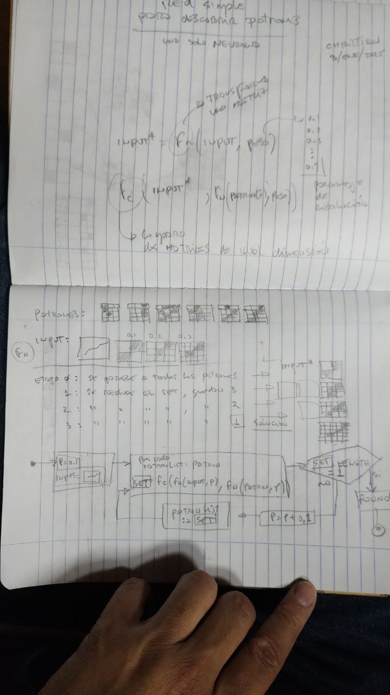

# ia-reconoce-patrones
una pequeña red simple que reconoce patrones

este modelo es una red neural simple, en cada "generación" incrementa en 1
el valor de la dimensión de la matriz que se usa para analizar cada imagen
para luego compararla con unos patrones conocidos que alimentan de "conocimiento"
a esta red simple.

inicialmente recibe una imagen con un trazo aleatorio, llevará esa imagen
a una versión reducida (transformMatrix) con una resolución inicial minima,
una matriz de dimension 2 (2 filas x 2 columnas), con esa misma resolución
transformará cada imagen de los patrones conocidos en busqueda de aquellas
que sean similares.

en cada generacion se retroalimenta con los patrones conocidos seleccionados
en la generacion anterior, de esta forma solo va a comparar las imagenes
con mayor resolucion en cada nueva ronda pero solo con aquellos patrones
conocidos seleccionados.

el bucle termina cuando: hay un solo patron seleccionado (al inicio pueden
haber varios), o si no hay ningun patron hallado.

en las redes mas formales, tras cada generación se compara el resultado
obtenido con el resultado esperado; esta diferencia entre ambos resultados
se dispersa entre los nodos de la red, ajustandose asi con algo llamado
"back propagation". Acá en esta red no hay tal calculo de diferencia ni
back propagation, simplemente se ajusta el "peso" incrementando en 1 
la dimensión de la matriz en cada generacion hasta dar con la imagen
del patron que mas se le parezca.

en nuevas versiones agregaré como parametros de la red (pesos) a un valor
de control de ruido que puse en la funcion `transformMatrix`, la cual
es una funcion que transforma una matriz de una dimension a otra; en este
proceso habran datos que se pierden o que pueden generar ruido, este ruido
puede graduarse con una constante (por ahora) pero pretendo convertirla
en un peso que la red pueda ajustar para asi afinar el control de ruido
con el objeto de mejorar la precisión a la hora de dar con el patron
indicado.

este codigo me tomó 30 minutos en hacerlo. el dibujo en papel lo diseñe
en un par de horas. al momento funciona muy bien.

en el modelo en papel, las funciones son las siguientes:

"Fn" : equivale a `transformMatrix()`, convierte una matrix de una dimension a otra,
añade además un filtro de ruido.

"Fc" : equivale a `compareMatrix`, compara dos matrices a ver si son iguales. hace
una comparacion absoluta. en el futuro, esta funcion debería tener parametros de
sensibilidad para que puedan ser ajustados como "pesos" por la red.

